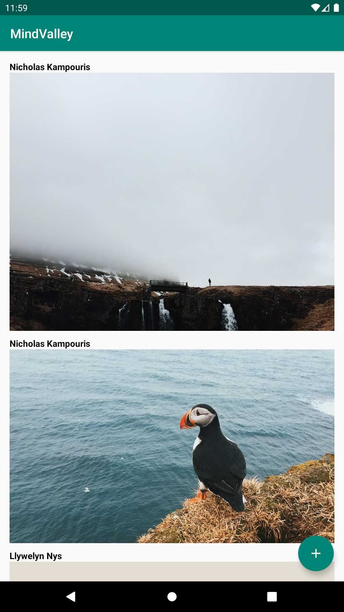
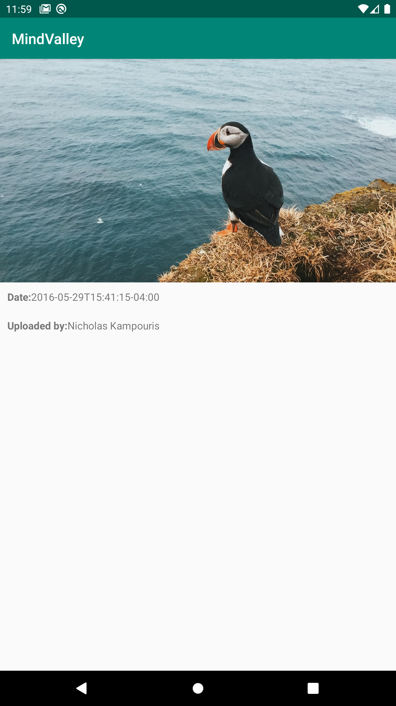
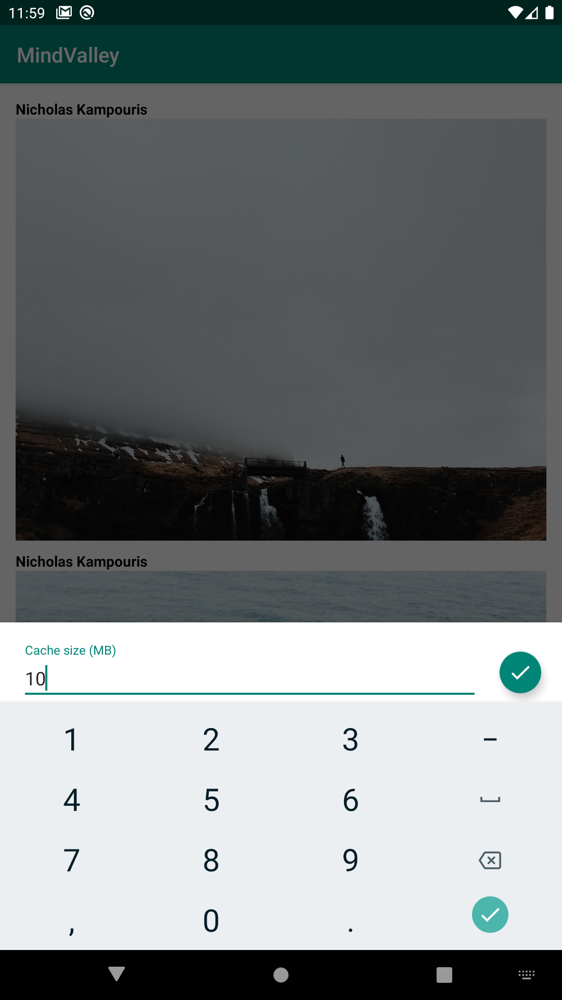

### Mindvalley Assessment Test (Url Loader)
Url Loader is one of android libs that helping to download images and JSON in addition to cached them efficiently.	 

### Task 
Creating an image loading library that will be used to asynchronously download the images for the pins on the pinboard when they are needed Like PinterestApp.

# Requirement

    1. Use the following url for loading data: http://pastebin.com/raw/wgkJgazE
    2. Images and JSON should be cached efficiently (in-memory only, no need for caching to disk);
    3. The cache should have a configurable max capacity and should evict images not recently used;
    4. An image load may be cancelled;
    5. The same image may be requested by multiple sources simultaneously (even before it has loaded), and if one of the sources cancels the load, it should not affect the remaining requests;
    6. Multiple distinct resources may be requested in parallel;
    7. You can work under the assumption that the same URL will always return the same resource;
    8. The library should be easy to integrate into new Android project / apps;
    9. You are supposed to build a solid structure and use the needed programming design patterns;
    10. Think that the list of item returned by the API can reach 100 items or even more. At a time, you should only load 10 items, and load more from the API when the user reach the end of the list;
    11. Usage of Material Design UI elements (Ripple, Fab button, Animations) is an advantage;
    12. Adding "pull to refresh" is an advantage.
  
  
## Getting Started

These instructions will get you a copy of the project up and running on your local machine for development and testing purposes. See deployment for notes on how to deploy the project on a live system.


### Installing

A step by step series of examples that tell you have to get a development env running

Say what the step will be

```
allprojects {
		repositories {
			maven { url 'https://jitpack.io' }
		}
	}
```

```
dependencies {
	        implementation 'com.github.MahmoudZaherDeveloper:MindvalleyAssignment:1.0'
	}
```
    
### And coding style tests
### Library functionality relies on Downloadable class.
```kotlin
//Using WeirdFileFormat with illustrative purpose
class CustomDownloadable(url: String):Downloadable<WeirdFileFormat>(url){
   	override fun transform(content: DownloadableContent): CustomType {
   		return WeirdFileFormat.fromBytes(content)
	}
}
```
* Screenshots  


 


## Authors

* **Mahmoud Zaher** 


## Contributing
All pull requests are welcome, make sure to follow the contribution guidelines when you submit pull request.

1. Fork it!
2. Checkout the development branch: git checkout development
3. Create your feature branch: git checkout -b my-new-feature
4. Add your changes to the index: git add .
5. Commit your changes: git commit -m 'Add some feature'
6. Push to the branch: git push origin my-new-feature
7. Submit a pull request against the development branch
